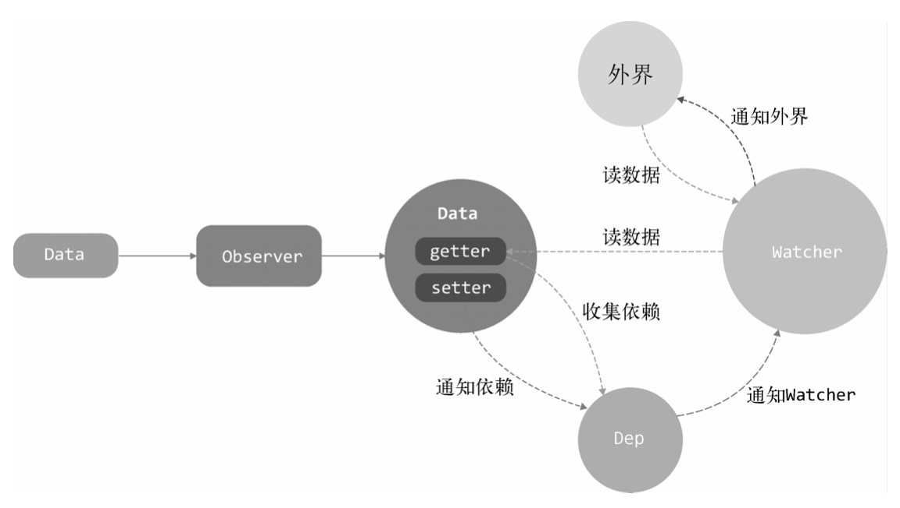

## 变化侦测
数据模型仅仅是普通的js对象，修改数据，侦测数据的变化，更新视图  
**Vue对于Object和Array的变化侦测是采用不同的处理方式**
## Object的变化侦测
vue.js会自动通过状态生成DOM，并且在页面上显示，这个过程即是渲染  
vue.js2.0引入虚拟DOM, 一个状态所绑定的依赖**粒度**不再是具体的DOM节点，而是一个**组件**，状态变化会通知到组件，组件内部再使用虚拟DOM进行比对
### 如何追踪变化？Object.defineProperty(vue3.0使用Proxy)
````js
function defineReactive(data,key,val){
  Object.defineProperty(data,key,{
      enumerable:true,
      configurable: true,
      get: function(){
          return val
      },
      set: function(newVal){
          if(val === newVal){
              return
          }
          val = newVal
      }
  })
}
````
### 如何收集依赖？
````html
<template>
   <p>{{ name }}</p>
</template>
````
vue2.0,模板使用数据等同于组件使用数据  
>收集依赖 就是把用得到数据name的地方收集起来，等属性发生变化，把收集好的依赖循环触发一遍
### 依赖收集在哪儿？
getter中收集依赖，那么到底把依赖收集到哪里去了呢？ **dep数组**
````js
// Dep类专门用来帮助我们管理依赖，发布订阅模式，使用这个类可以收集依赖、删除依赖、向依赖发送通知
export default class Dep{
    constructor(){
        this.subs = []
    }

    addSub(sub){
        this.subs.push(sub)
    }

    removeSub(sub){
        remove(this.subs,sub)
    }
    
    depend(){
        // 假设依赖是一个函数，保存在window.target上
        if(window.target){
            this.addSub(window.target)
        }
    }
    
    notify(){
        const subs = this.subs.slice()
        for(let i=0;i<subs.length;i++){
            subs[i].update()
        }
    }
}

function remove(arr,item){
    if(arr.length){
        const index = arr.indexOf(item)
        if(index >-1){
            return arr.splice(index,1)
        }
    }
}
````
````js
// 改造一下defineReactive函数
function defineReactive(data,key,val){
    let dep = new Dep()
    Object.defineProperty(data,key,{
      enumerable:true,
      configurable: true,
      get: function(){
          dep.depend()
          return val
      },
      set: function(newVal){
          if(val === newVal){
              return
          }
          val = newVal
          dep.notify()
      }
    })
}
````
### 依赖是谁？
上面的例子，收集的依赖是window.target, 这个到底是个什么？**收集谁，即当监听对象的属性发生变化后，通知谁**,**依赖，就是谁会去用这份数据**，用数据的地方有很多，类型还不一样，可能是模板、也可能是用户写的一个watch，需要抽象出一个类来处理这些不同的情况，这样**在依赖收集阶段，只收集这个封装好的类的实例进来**，通知也只通知它一个，接着，它在负责通知其他地方，抽象出来的类，就是**Watcher**
### 什么是Watcher?
Watcher是一个中介的角色，数据变化的时候通知它，然后它再通知其他地方
````js
vm.$watch('a.b.c', function(newVal,oldVal){
    // todos
})

// 这个例子就是变色当data.a.b.c的属性发生变化，触发第二个参数的回调函数
````
````js
export default class Watcher{
    constructor(vm, expOrFn, cb){
        this.vm = vm;
        this.getter = parsePath(expOrFn) // 执行this.getter(),就可以读取data.a.b.c的内容
        this.cb = cb
        this.value = this.get()
    }

    get(){
        window.target = this
        let value = this.getter.call(this.vm, this.value)
        window.target = undefined
        return value
    }

    update(){
        const oldValue = this.value
        this.value =  this.get()
        this.cb.call(this.vm,this.value,oldValue)
    }
}

/*
  该代码可以主动把 当前的watch实例 主动添加到 data.a.b.c 的Dep中去
  1. 在get方法中，先把window.target设置成了this(当前watch实例)，再读一遍data.a.b.c的值，这肯定会触发getter(Object.defineProperty)
  2. 触发了getter,就会触发收集依赖的逻辑，也就是会从window.target中读取依赖并读取到Dep中
  所以，只要先在window.target赋一个this, 然后再读一下值，去触发getter, 就可以主动把this添加到keypath的Dep中

  依赖注入到Dep中后，每当data.a.b.c的值发生变化，就会让依赖列表中所有的依赖循环触发update方法，即Watcher中的update方法，而update方法会执行参数中的回调函数，将value和oldValue传到参数中
  所以，不管是用户执行 vm.$watch('a.b.c', (value,oldValue)=>{}), 还是模板中 用到的data, 都是通过 Watcher 来通知自己是否需要变化
*/
````
### 递归侦测所以key
上述示例只能侦测数据中的某一个属性，期望把数据中的**所有属性（包括子属性）** 都侦测到，因此要封装一个**Observer类，这个类的作用就是将一个数据内的所有属性（包括子属性）都转换成getter/setter 的形式**
````js
/*
  Observer类会附加到每一个被侦测的object上，
  一旦被附加上，Observer会将object的所有属性转换成getter/setter的形式来收集属性的依赖，并且当属性发生变化时会通知这些依赖
*/
export class Observer{
    constructor(value){
        this.value = value

        if(!Array.isArray(value)){
            this.walk(value)
        }
    }

    /*
       walk会将每个属性都转换成getter/setter的形式来侦测变化
       这个方法只有在数据类型为object时被调用
     */
     walk(obj){
         const keys = Object.keys(obj)
         for(let i=0;i<keys.length;i++){
             defineReactive(obj,keys[i],obj[keys[i]])
         }
     }
}

function defineReactive(data,key,val){
    // 新增，递归子属性
    if(typeof val === 'object'){
        new Observer(val)
    }
    let dep = new Dep()
    
    Object.defineProperty(data,key,{
      enumerable:true,
      configurable: true,
      get: function(){
          dep.depend()
          return val
      },
      set: function(newVal){
          if(val === newVal){
              return
          }
          val = newVal
          dep.notify()
      }
    })
}
````
**只要我们将一个object传到Observer中，那么这个object就会变成响应式的**
### 关于Object的问题
有时候，有些语法数据发生变化，vue.js追踪不到
````js
var vm = new Vue({
    el: '#el',
    template: '#demo-template',
    methods:{
        action(){
            this.obj.name = 'qgq'
        }
    },
    data:{
        obj:{}
    }
})
````
当我们在obj上面新增或删除一个属性，vue.js是无法侦测到这个变化  
**vue.js通过Object.defineProperty来将对象的key转换成getter/setter的形式来追踪变化，但是getter/setter职能追踪一个数据是否被修改，无法追踪新增属性和删除属性**  
这是因为在ES6之前，js没有提供元编程支持，为了解决这个问题，vue.js提供了两个API  vm.$set与 vm.$delete
### 小结：Data、Observer、Dep和Watcher之间的关系
* Data通过Observer转换成了getter/setter的形式来追踪变化
* 当外界通过Watcher读取数据时，会触发getter从而将Watcher添加到依赖中
* 当数据发生了变化时，会触发setter，从而向Dep中的依赖（Watcher) 发送通知
* Watcher接收到通知后，会向外界发送通知，变化通知到外界后，可能会触发视图更新，也有可能触发用户的某个回调函数等


## Array的变化侦测
````js
this.list.push(1)

/*
  我们使用push方法向list中新增了数字1
  对于数组，用push方法改变了数组，并不会触发getter/setter
*/
````
Object的变化是靠setter来追踪的，只要属性发生变化，就会触发setter  
顺着这个思路，当用push来改变数组的内容，是不是只要在用户使用push操作数组的时候得到通知，就能达到同样的目的   
然而，在ES6之前，js并没有提供拦截原型方法的能力，尤大就**重写了数组的那些方法，用自定义的方法去覆盖原生的原型方法**  


如图，我们可以用一个拦截器覆盖Array.prototype, 之后，当**使用Array原型上的方法操作数组时，其实执行的都是拦截器中提供的方法，然后再在拦截器中使用原生的数组原型方法去操作数组**
### 拦截器
拦截器就是用来帮我们追踪到Array的变化  
拦截器就是一个和Array.prototype几乎一样的Object, 差别在于其中，某些可以改变数组自身内容的方法我们处理过  
在Array原型中可以改变数组自身内容的方法有7个：push、pop、shift、unshift、splice、sort、reverse
````js
const arrayProto = Array.prototype

// arrayMethos.__proto__ = Array.prototype 相当于创建了个数组实例
export const arrayMethods = Object.create(arrayProto)

['push','pop','shift','unshift','splice','sort','reverse'].forEach(function(method){
    const original = arrayProto[method] // 缓存原始方法
    Object.defineProperty(arrayMethods,method,{
       value: function mutator(...args){
          return original.apply(this,args)
       },
       enumerable: false,
       writable: true,
       configurable: true
    })
})


/*
  变量arrayMethods, 它继承自Array.prototype，具备其所有功能，未来，我们要用其去覆盖Array.prototype
  在arrayMethods上使用 Object.defineProperty方法将那些可以改变数组自身内容的方法进行封装
  所以，当使用push方法的时候，其实调用的是arrayMethods.push, 而arrayMethods.push就是函数mutator, 实际上执行的也就是mutator函数  
  最后，在mutator中执行original(它是原生Array.prototype上的方法，比如Array.prototype.push)来做它该做的(push功能)
  当然，我们可以再对这个mutator函数中做一些其他的事，比如说发送变化通知
*/
````
## 使用拦截器覆盖Array原型
有了拦截器，想要让它生效，就需要使用它去覆盖Array.prototype，但是我们又不能直接覆盖，因为这样会污染全局的Array  
我们只是希望拦截操作只针对那些被侦测了变化的数据生效，也就是说**期望拦截器只是覆盖那些响应式数据的原型**  
而将一个数据转换成响应式的，需要通过Observer
````js
export class Observer{
    constructor(value){
        this.value = value
        if(Array.isArray(value)){
            value.__proto__ = arrayMethods
        }else{
            this.walk(value)
        }
    }
}
````


