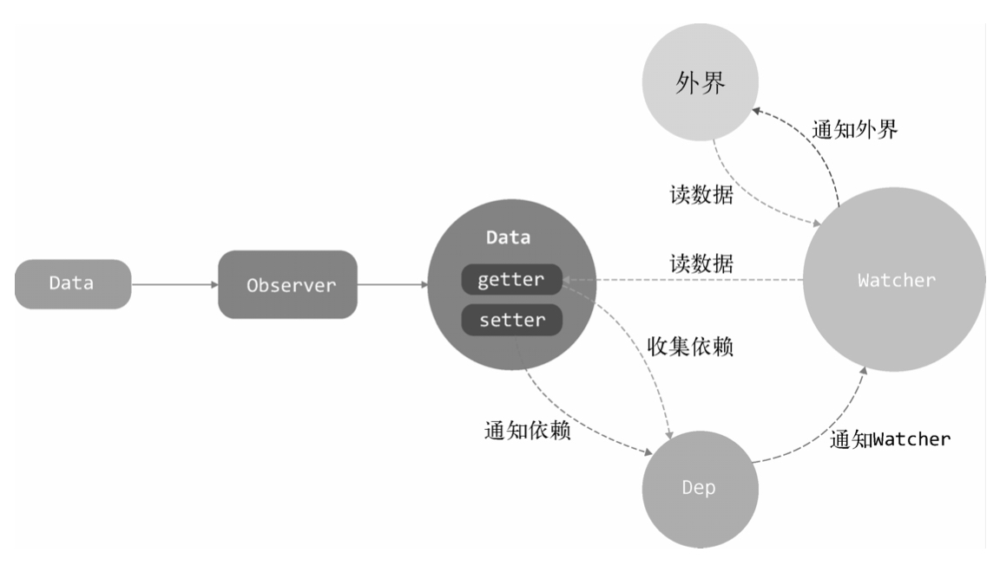

## 变化侦测
数据模型仅仅是普通的js对象，修改数据，侦测数据的变化，更新视图  
**Vue对于Object和Array的变化侦测是采用不同的处理方式**
## Object的变化侦测
vue.js会自动通过状态生成DOM，并且在页面上显示，这个过程即是渲染  
vue.js2.0引入虚拟DOM, 一个状态所绑定的依赖**粒度**不再是具体的DOM节点，而是一个**组件**，状态变化会通知到组件，组件内部再使用虚拟DOM进行比对
### 如何追踪变化？Object.defineProperty(vue3.0使用Proxy)
````js
function defineReactive(data,key,val){
  Object.defineProperty(data,key,{
      enumerable:true,
      configurable: true,
      get: function(){
          return val
      },
      set: function(newVal){
          if(val === newVal){
              return
          }
          val = newVal
      }
  })
}
````
### Object.defineProperty vs Proxy
两个都是用来做数据劫持的，数据劫持：在访问或者修改对象的某个属性时，通过一段代码拦截这个行为，可以再进行额外的操作或者直接返回结果，vue的双向数据绑定就是数据劫持的典型应用  
````js
/*
target: 要被包装的目标对象，可以是任何类型的对象，包括原生数组、函数、甚至可以是另一个代理  
对象：就是针对整个对象，而不是某个属性，就省去了像Object.defineProperty那样用Object.keys()循环遍历的步骤  
数组：不需要再重写7大方法，省去了众多hack
嵌套：get里面递归调用Proxy并返回
handler: 一个对象，当执行一个操作时定义代理的行为函数
*/
let obj = {
    name:'qgq',
    age:23,
}
let handler = {
    get(target,key,receiver){
       console.log('get',key)
       // 递归，支持嵌套
       if(typeof taeget[key] === 'object' && target[key] !== null){
           return Reflect.get(target,key,receiver)
       }
       return Reflect.get(target,key,receiver)
    },
    set(target,key,value,receiver){
       console.log('set',key,value)
       return Reflect.set(target,key,value,receiver)
    }
}
let p = new Proxy(obj,handler)
proxy.name = 'augus' // set name augus
proxy.age  =  30     // set age 30

// Reflect是一个内置对象，区别于Object，Reflect是不可构造的（不能new)，它的方法和属性都是静态的
let array = [1,2,3,4]
array.forEach((val,index)=>{
  Object.defineProperty(array,index,{
    get:function(){
        console.log('读取了')
        return val
    },
    set:function(newVal){
       val = newVal
    }
  })
})
console.log(array[0])
````
### 如何收集依赖？
````html
<template>
   <p>{{ name }}</p>
</template>
````
vue2.0,模板使用数据等同于组件使用数据  
>收集依赖 就是把用得到数据name的地方收集起来，等属性发生变化，把收集好的依赖循环触发一遍
### 依赖收集在哪儿？
getter中收集依赖，那么到底把依赖收集到哪里去了呢？ **dep数组**
````js
// Dep类专门用来帮助我们管理依赖，发布订阅模式，使用这个类可以收集依赖、删除依赖、向依赖发送通知
export default class Dep{
    constructor(){
        this.subs = []
    }

    addSub(sub){
        this.subs.push(sub)
    }

    removeSub(sub){
        remove(this.subs,sub)
    }
    
    depend(){
        // 假设依赖是一个函数，保存在window.target上
        if(window.target){
            this.addSub(window.target)
        }
    }
    
    notify(){
        const subs = this.subs.slice()
        for(let i=0;i<subs.length;i++){
            subs[i].update()
        }
    }
}

function remove(arr,item){
    if(arr.length){
        const index = arr.indexOf(item)
        if(index >-1){
            return arr.splice(index,1)
        }
    }
}
````
````js
// 改造一下defineReactive函数
function defineReactive(data,key,val){
    let dep = new Dep()
    Object.defineProperty(data,key,{
      enumerable:true,
      configurable: true,
      get: function(){
          dep.depend()
          return val
      },
      set: function(newVal){
          if(val === newVal){
              return
          }
          val = newVal
          dep.notify()
      }
    })
}
````
### 依赖是谁？
上面的例子，收集的依赖是window.target, 这个到底是个什么？**收集谁，即当监听对象的属性发生变化后，通知谁**,**依赖，就是谁会去用这份数据**，用数据的地方有很多，类型还不一样，可能是模板、也可能是用户写的一个watch，需要抽象出一个类来处理这些不同的情况，这样**在依赖收集阶段，只收集这个封装好的类的实例进来**，通知也只通知它一个，接着，它在负责通知其他地方，抽象出来的类，就是**Watcher**
### 什么是Watcher?
Watcher是一个中介的角色，数据变化的时候通知它，然后它再通知其他地方
````js
vm.$watch('a.b.c', function(newVal,oldVal){
    // todos
})

// 这个例子就是变色当data.a.b.c的属性发生变化，触发第二个参数的回调函数
````
````js
export default class Watcher{
    constructor(vm, expOrFn, cb){
        this.vm = vm;
        this.getter = parsePath(expOrFn) // 执行this.getter(),就可以读取data.a.b.c的内容
        this.cb = cb
        this.value = this.get()
    }

    get(){
        window.target = this
        // getter参数里面记录了一个非常重要的东西，vm._update(vm._render())
        // vm._update的作用就是调用虚拟DOM中的patch方法来执行节点的比对和渲染操作，_render的作用就是执行渲染函数，得到一份最新的VNode节点树
        // 通知render watcher去更新视图时，就是触发render函数、生成vnode树、diff、patch
        let value = this.getter.call(this.vm, this.value)
        window.target = undefined
        return value
    }

    update(){
        const oldValue = this.value
        this.value =  this.get()
        this.cb.call(this.vm,this.value,oldValue)
    }
}

/*
  该代码可以主动把 当前的watch实例 主动添加到 data.a.b.c 的Dep中去，只要先在window.target赋一个this, 然后再读一下值去触发getter, 就可以主动把this添加到keypath的Dep中
  1. 在get方法中，先把window.target设置成了this(当前watch实例)，再读一遍data.a.b.c的值，这肯定会触发getter(Object.defineProperty)
  2. 触发了getter,就会触发收集依赖的逻辑，也就是会从window.target中读取依赖并读取到Dep中(watcher在读取数据前，是设置在全局window.target中的，数据被读取触发getter，也就是会把watcher收集到依赖列表中，数据发生变化，就会向watcher发送通知)
  

  依赖注入到Dep中后，每当data.a.b.c的值发生变化，就会让依赖列表中所有的依赖循环触发update方法，即Watcher中的update方法，而update方法会执行参数中的回调函数，将value和oldValue传到参数中
  所以，不管是用户执行 vm.$watch('a.b.c', (value,oldValue)=>{}), 还是模板中 用到的data, 都是通过 Watcher 来通知自己是否需要变化
*/
````
> 大致回顾整个流程：从调用Dep实例的notify方法，notify方法中会循环一个subs的数组，数组里存的就是Watcher，从数组中遍历然后执行单个watcher的update方法，update方法中会维护一个异步更新队列。Watcher的update方法会先去触发getter，再触发回调，更新视图或是执行其他任务
### 递归侦测所以key
上述示例只能侦测数据中的某一个属性，期望把数据中的**所有属性（包括子属性）** 都侦测到，因此要封装一个**Observer类，这个类的作用就是将一个数据内的所有属性（包括子属性）都转换成getter/setter 的形式**
````js
/*
  Observer类会附加到每一个被侦测的object上，
  一旦被附加上，Observer会将object的所有属性转换成getter/setter的形式来收集属性的依赖，并且当属性发生变化时会通知这些依赖
*/
export class Observer{
    constructor(value){
        this.value = value

        if(!Array.isArray(value)){
            this.walk(value)
        }
    }

    /*
       walk会将每个属性都转换成getter/setter的形式来侦测变化
       这个方法只有在数据类型为object时被调用
     */
     walk(obj){
         const keys = Object.keys(obj)
         for(let i=0;i<keys.length;i++){
             defineReactive(obj,keys[i],obj[keys[i]])
         }
     }
}

function defineReactive(data,key,val){
    // 新增，递归子属性
    if(typeof val === 'object'){
        new Observer(val)
    }
    let dep = new Dep()
    
    Object.defineProperty(data,key,{
      enumerable:true,
      configurable: true,
      get: function(){
          dep.depend()
          return val
      },
      set: function(newVal){
          if(val === newVal){
              return
          }
          val = newVal
          dep.notify()
      }
    })
}
````
**只要我们将一个object传到Observer中，那么这个object就会变成响应式的**
### 关于Object的问题
有时候，有些语法数据发生变化，vue.js追踪不到
````js
var vm = new Vue({
    el: '#el',
    template: '#demo-template',
    methods:{
        action(){
            this.obj.name = 'qgq'
        }
    },
    data:{
        obj:{}
    }
})
````
当我们在obj上面新增或删除一个属性，vue.js是无法侦测到这个变化  
**vue.js通过Object.defineProperty来将对象的key转换成getter/setter的形式来追踪变化，但是getter/setter职能追踪一个数据是否被修改，无法追踪新增属性和删除属性**  
这是因为在ES6之前，js没有提供元编程支持，为了解决这个问题，vue.js提供了两个API  vm.$set与 vm.$delete
### 小结：Data、Observer、Dep和Watcher之间的关系
* Data通过Observer转换成了getter/setter的形式来追踪变化
* 当外界通过Watcher读取数据时，会触发getter从而将Watcher添加到依赖中
* 当数据发生了变化时，会触发setter，从而向Dep中的依赖（Watcher) 发送通知
* Watcher接收到通知后，会向外界发送通知，变化通知到外界后，可能会触发视图更新，也有可能触发用户的某个回调函数等


